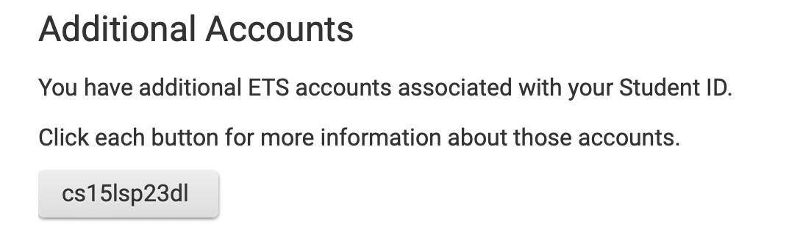
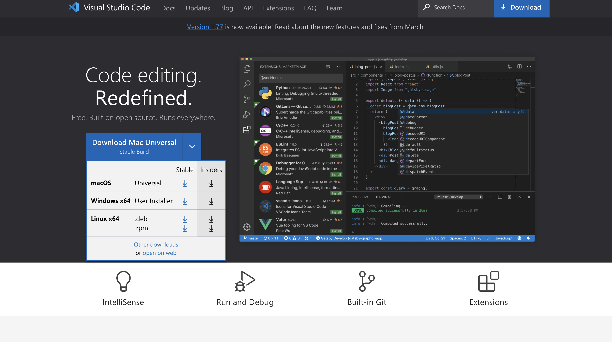
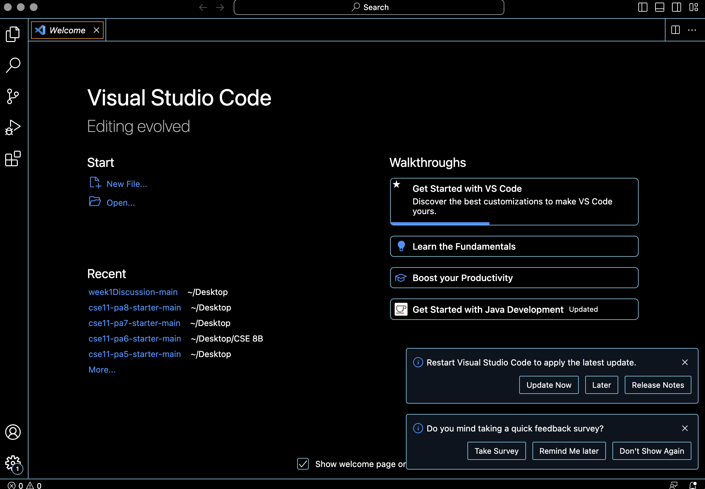
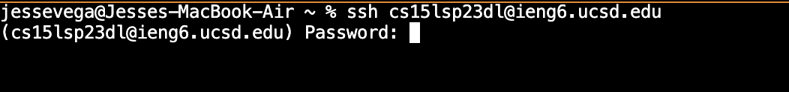
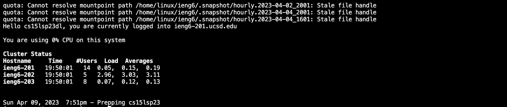
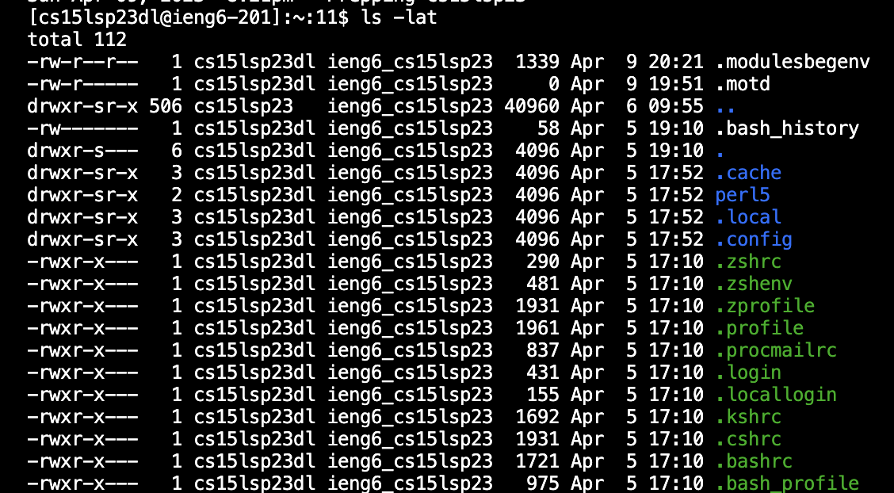

# Tutorial
## *How To Log Into a Course-Specific Account On ieng6*
---
## Step 1: Find your account
- **Go to this [Link](https://sdacs.ucsd.edu/~icc/index.php)**
- **Input your username and id into the account lookup section**
- **Once in, click the cse15lsp23zz(It should be your own in zz):** 
- **After you click that, click the reset password hyper link. It should be the only reset password hyperlink.**
- **IMPORTANT!! Use your cse15L username to reset**
- **Once password is reset, you are done with step 1.**

## Step 2: Download Visual Studio Code
- **Go to [Link](https://code.visualstudio.com/) to download Visual Studio Code on your personal device**
- **When opened you should get a screen like this. Choose the download that matches your device. From there it should download straightly to your computer.** 
- **Once downloaded. Click the download and it should open Visual Studio code. Your page should look like this:** 
- **You did it!! You are now ready to use visual studio code**

## Step 3: Remotely connecting
- **Open up Visual Studio Code and open up a new terminal.(Cntrl or Command +)**
- **Now in the terminal you are going to run your first command. You should use your account that you seen in step one. Input into the terminal exactly like this: `ssh cs15lsp23zz@ieng6.ucsd.edu` (Remeber to switch zz to your own). If you don't know your account number refer to STEP 1. Your specific account is found in the circled part. And if you need to reset your password do the folowing steps in STEP 1**
- **Once you input your password press return. Now password should pop up. Enter your password that you made in step one. Note: Wait fifteen minutes after you created it.(Letters will not pop up while you type)** 
- **Once password is entered and you hit return. You should get some code at the bottom that looks like this:**
- **You are now ready to run some commands**

## Step 4: Trying some commands
- **Commands to run in terminal:**
- `cd ~`: This will get you the path before your current working directory
- `cd`: This will show you the path directory of your current working directory
- `ls -a`: This will show you every file in -a
- `cat /home/linux/ieng6/cs15lsp23/public/hello.txt`: It will print what is in hello.txt
- **You'll get some pretty interesting results.**
- **Here is one example running `ls -lat`(What is happening here is that it will list all the files and directories in you account. This is the all the contents in our working directory listed in a list speerated by each line. Each line begins with, owner followed by the file size. The created/modified date and time. And lastly the file/folder name as some of the attributes.):**

