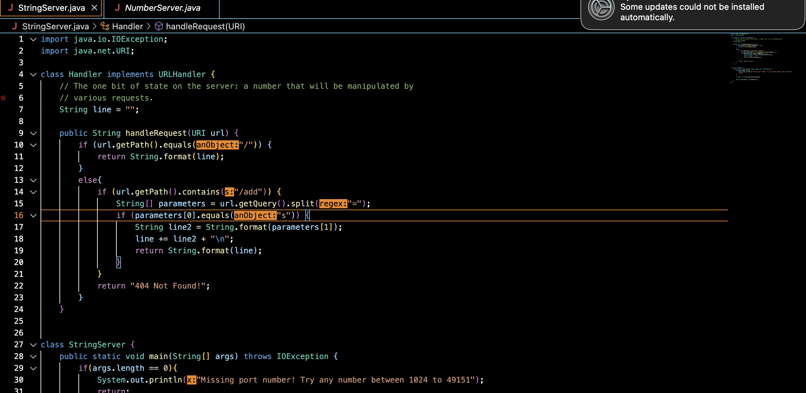
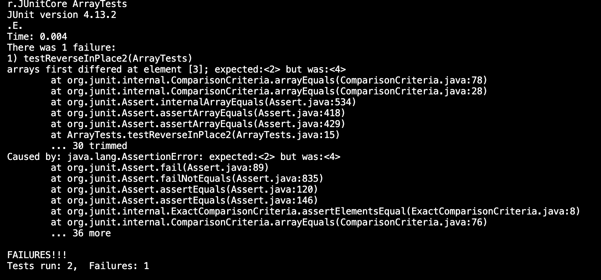

# Lab 2
## Part 1: StringServer
- **Here is my code:** 
- **Here are my two screenshots of my code working:**
- **Screenshot 1:** `http://localhost:2323/add-message?s=Jesse`: 
**What is happeing:**
- Note: The line varibles is an empty string "" as of now, since we just loaded the url for the first time.
- The first method called is the handlerequest. `public String handleRequest(URI url) {`: The URI in this example is the url, the url variable is then equal to http://localhost:2323/add-message?s=Jesse.
- Now in this example, /add is found in the our url so that brings us to the else stament.
- `String[] parameters = url.getQuery().split("=");` : This line then sets parameter equal ["s","Jesse"] as it splits the query into two strings. Strings because of the type before the parameter variable.
- `if (parameters[0].equals("s")) {`: Parameters index 0 is equal to s so we move on with the if statemnet.
- `String line2 = String.format(parameters[1]);` : line2 will equal the index 1 of parameter which is "Jesse". So the variable line2 is now eqaul to "Jesse" in this case.
- `line += line2 + "\n";` line will then add/equal line 2. So line will equal the string "Jesse"
- `return String.format(line);` This will finally return what we see in the code above. Line will equal that until you repeat, which will then change it. You will see that in the next step.
- **Screenshot 2:** `http://localhost:2323/add-message?s=Vega`: 
**What is happening:**
- Note: The line variable is equal to the string Jesse as of now, since in our first step we set line equal to Jesse. 
- The first method called is the handlerequest. `public String handleRequest(URI url) {`: The URI in this example is the url, the url variable is then equal to http://localhost:2323/add-message?s=Vega.
- Now in this example, /add is found in the our url so that brings us to the else stament. 
- `String[] parameters = url.getQuery().split("=");` : This line then sets parameter equal ["s","Vega"] as it splits the query into two strings. Strings because of the type before the parameter variable. 
- `String line2 = String.format(parameters[1]);` : line2 will equal the index 1 of parameter which is "Vega". So the variable line2 is now eqaul to "Vega" in this case. 
- `line += line2 + "\n";` line will then add/equal line 2. It is importan to notice the `\n` because that starts the new line.
- `return String.format(line);` This will finally return what we see in the code above. The line variable will equal that until you repeat, which will then change it.

  
## Part 2: Bugs
- **Doesn't induce failure:** `public void testReverseINPlace() {
    int[] input1 = { 15 };
    ArrayExamples.reverseInPlace(input1);
    assertArrayEquals(new int[]{ 15 }, input1);
	}`
- **Induces Failure :** `public void testReverseInPlace2() {
    int[] input1 = { 1,2,3,4,5 };
    ArrayExamples.reverseInPlace(input1);
    assertArrayEquals(new int[]{5,4,3,2,1}, input1);
	}`
  
- **Output:** 
- **Before:**  `static void reverseInPlace(int[] arr) {
    for(int i = 0; i < arr.length; i += 1) {
      arr[i] = arr[arr.length - i - 1];
    }
  }`
- **After:**  `static void reverseInPlace(int[] arr) {
    for(int i = 0; i < (arr.length/2); i += 1) {
    int temp = arr[i];//need to set it to varible
      arr[i] = arr[arr.length - i - 1];// make sure the middle elemnt stays//same as other note
      arr[arr.length-i-1]= temp;
    }
  }`
- **Why it didn't work before: Before the fix the last half of the array was not being reversed, it was just staying unchanged. In the for loop it did the entire array which it then rversed the second half of the array that we just reversed. Basically, it reveresed back into the original array, after we just changed it.**
- **Why it works now: It works now because in the for loop we had to divide the array by two since we want the middle to stay the same. Then I needed to set it as a variable so I made the new variable temp. In the lat line  I made sure the element stayed in the middle and made the variable equal to temp.**

	
## Part 3: What I learned
- **During week 3, I found the URL very interesting. Before I had no idea what was in a url. I thought there was no patterns to them, and that it was all just random stuff made for each websites. But after learning, the domain, the paths, and the query it makes a lot more sense. Now when I look at the url, I can see what is happening and I notice it. It was also cool to see how to set up our own url. I had no idea we could do that with code, I just thought you always had to use a website like weebly or wix. I think it's my new favorite thing to make servers, and run stuff.**
