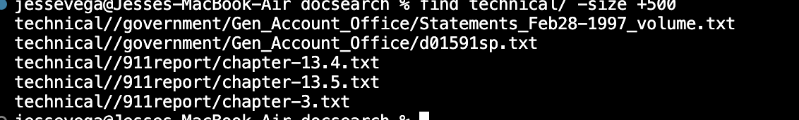
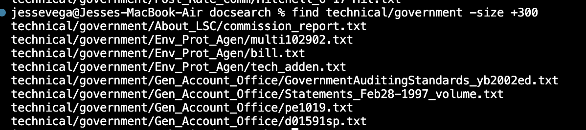
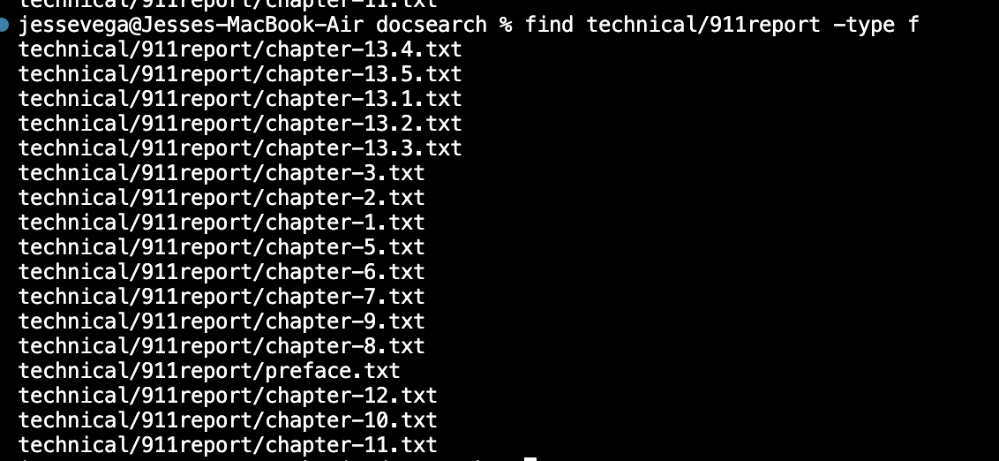
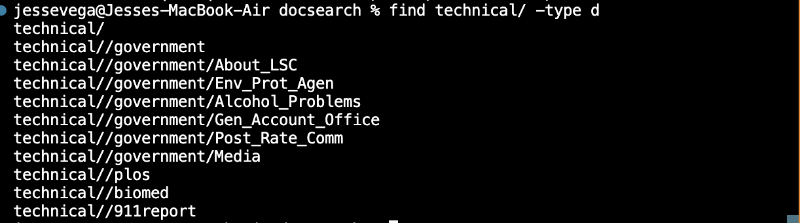
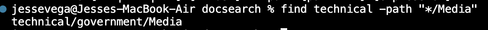
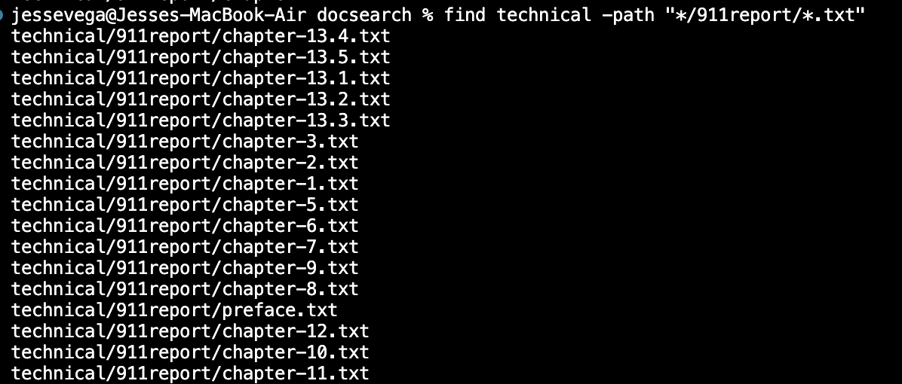
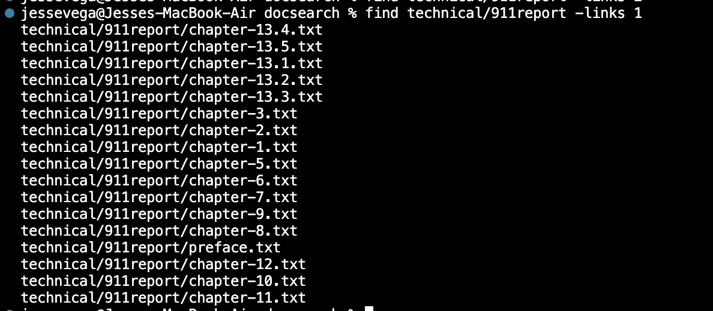

# Lab Report 3
## Researching Commands for find
- Command(Source:man find):`-size ___`

**What is happening: Here the find command is finding any files that have a file size greater than 500. That would be 500 bytes of course. That is any file in the technical directory. This is useful when you are just trying to find your bigger files.**

**What is happening here: Here the find command is finding any file that has a large size than 300 bytes. But, this is done in the government directory. That's why we see a different ouput than before. This is obviously useful when you are trying to find your smaller files.**
- Command(Source: [Link](https://man7.org/linux/man-pages/man1/find.1.html)):`-type ___`

**What is happening here: Here the find command is the type option to find a type. Our type we are looking for here is type f. The f standing for file, so it will find every file type that is in the 911 report. This is useful when you just want to find files and not directories.**

**What is happening here: Our type we are looking for here is type d. The d stands for directory. It will find all directories that are in technical directory. This is useful when you just want to find directories , and not files.**
- Command(Source:[Link](https://man7.org/linux/man-pages/man1/find.1.html)):"`-path (Pattern)`

**What is happening here: So the path command option looks for the path that you input. Where it says pattern that's where you would input the pattern. It will give you all the the possible paths that follow that pattern. Here there is just one. This is good when you are looking for the paths. Maybe it will help you figure out which directory you want to be in.**

**What is happening here: Agian the path command is looking for the path inputed. The * is like a fill in the blank. So anything could be in the star. It just has to follow the path inputed. This is good when we are looking for paths that kind of have similar paths.
- Command(Source: man find):"`-link ___`

**What is happening here: The link option command is looking for a number of links. The __ is where you input how many links you want it to look for. This helpful when you are trying to find a certain link.** 

**What is happening here: The link option comman here is looking for a file with 2 links. It is looking for 2 links in every file in technical, but here there are no files that have two links. That is why there is no output. This is useful to know, because like this example you figure out no file has 2 links in it.
