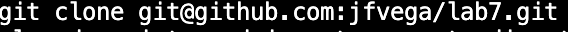
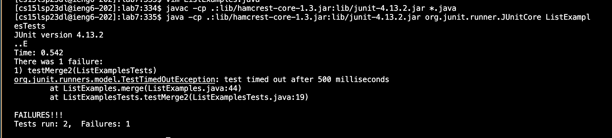
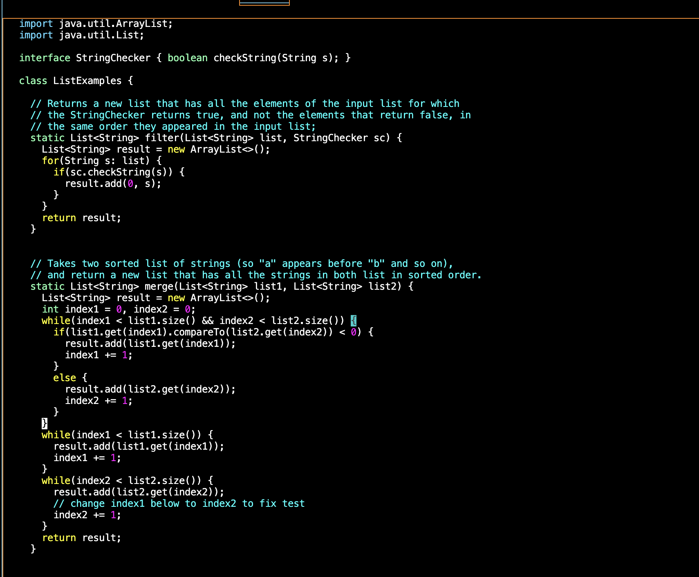
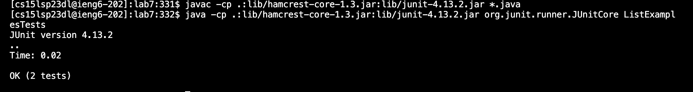
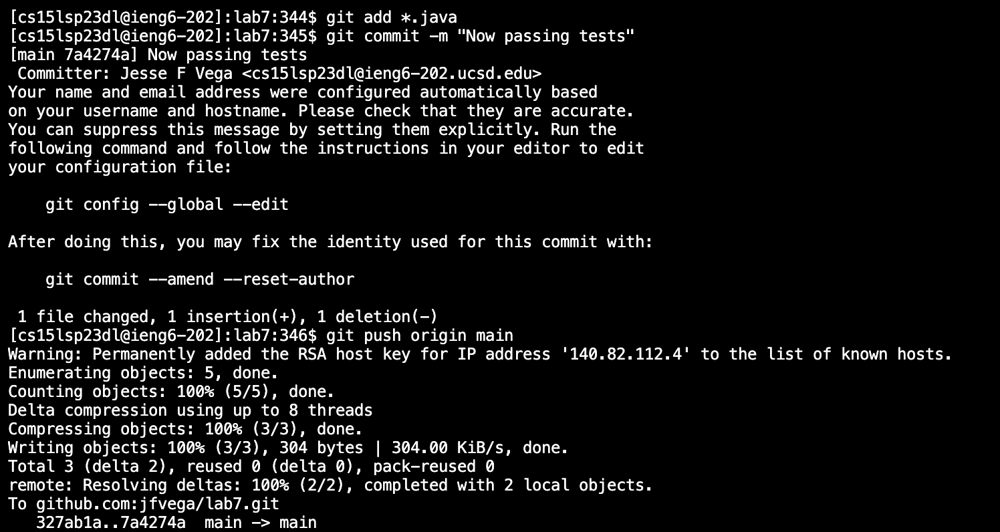

# Lab Report 4
## Baseline 
**Steps**

**4. Log into ieng6**

Keys pressed
- `history <enter>`: This command will pull all command history up
- `<up><up><up><up><up><up>`: This will go through the command history. As you press up you will go command by command until you press return which is the next step.
- `<return>`: Here I found the `ssh` command so I pressed enter.

**5. Clone your fork of the repository from your Github account**

- `git clone git@github.com:jfvega/lab7.git`: This me typing all in the command line. I am cloning the repository to my ieng6 account.

**6. Run the tests, demonstrating that they fail**

- `javac -cp .:lib/hamcrest-core-1.3.jar:lib/junit-4.13.2.jar *.java`: This will set it up to run the hamcrest.
- `java -cp .:lib/hamcrest-core-1.3.jar:lib/junit-4.13.2.jar org.junit.runner.JUnitCore ListExamplesTests`: This command will run the tests using Junit.

**7. Edit the code file to fix the failing test**

Keys Pressed
- `vim ListExamples.java`:The vim command will open the ListExamples.java in your terminal.
- `/index1 <enter>`: Here I am searching up the word index1. Vim will only go to words that follow that pattern.
- `<n><n><n><n><n><n><e><x><i><1>`: The `n` command is me going through the index1 keywords. I use them until I get to the last one. The `e` will go to the last letter of the word your highlighting. `x` will delete what you are highlighting. `i` will go into insert mode. Finally,`1` will insert the 1 into the file.
- `<esc>`: This will get you out of inset mode.
- `:wq`: This will save the changes you made to the file.

**8. Run the tests, demonstrating that they now succeed**

- `<up><up><up><return>`: This will result in looking through your previous commands which will print. It was up 3 in my command history. `javac -cp .:lib/hamcrest-core-1.3.jar:lib/junit-4.13.2.jar *.java`
- `<up><up><up><return>`: This will result in looking through your previous commands which will print. It was up 3 againg in my command history. `java -cp .:lib/hamcrest-core-1.3.jar:lib/junit-4.13.2.jar org.junit.runner.JUnitCore ListExamplesTests`

**9. Commit and push the resulting change to your Github account**

- `git add *.java <enter>`: This will add all the .java files in my directory of lab7.
- `git commit -m "Now passing tests" <enter>`: This will save the changed files with a message of "Now passing tests"
- `git push origin main <enter>`: This will upload the new changed repository on our github. 
