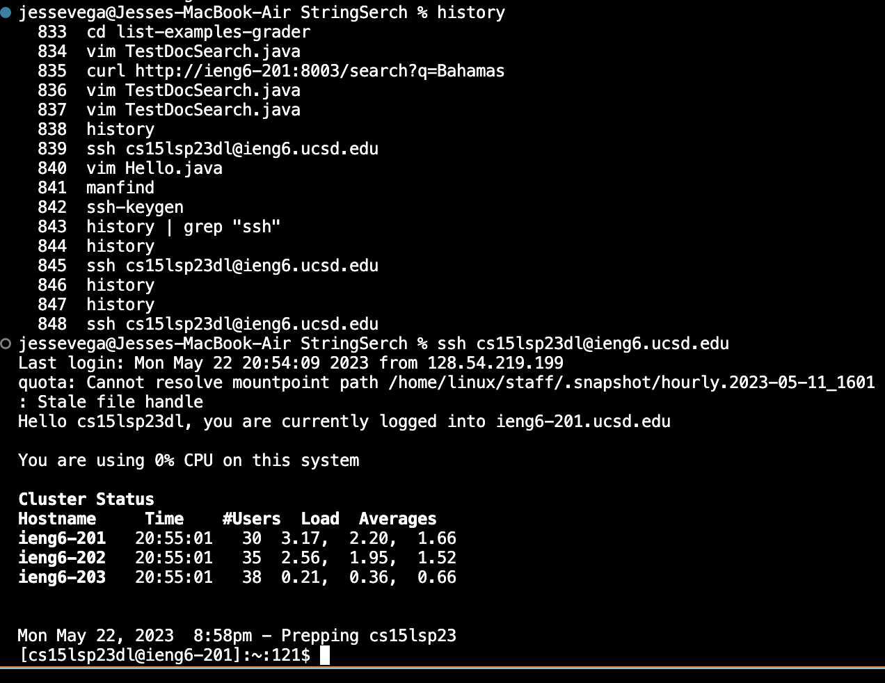

## Lab Report 4
# Baseline 
**Steps**
**1. Log into ieng6**

Keys pressed
- `history <enter>`
- `<up><up><up><up><up><up>`
- `<return>`

**2. Clone your fork of the repository from your Github account**

- `git clone https://github.com/ucsd-cse15l-s23/lab7`

**3. Run the tests, demonstrating that they fail**
- I am not sure how to run the tests I am having trouble doing that. Any clues?

**4. Edit the code file to fix the failing test**

Keys Pressed
- `vim ListExamples.java`
- `/index1 <enter>`
- `<n><n><n><n><n><n><e><x><i><1>`
- `<esc>`
- `:wq`

**5. Run the tests, demonstrating that they now succeed**
- I am also not sure how to do this

**6. Commit and push the resulting change to your Github account**
- Can't do this step without doing the last two. I will need to go to tutor hours for help
