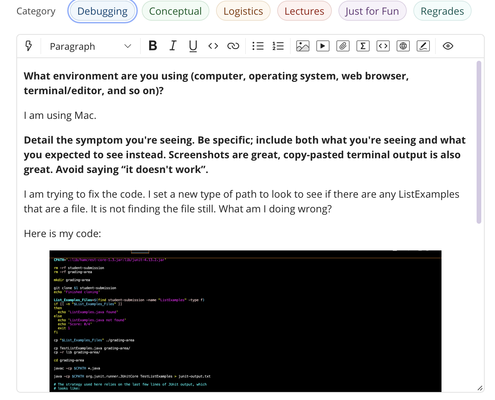
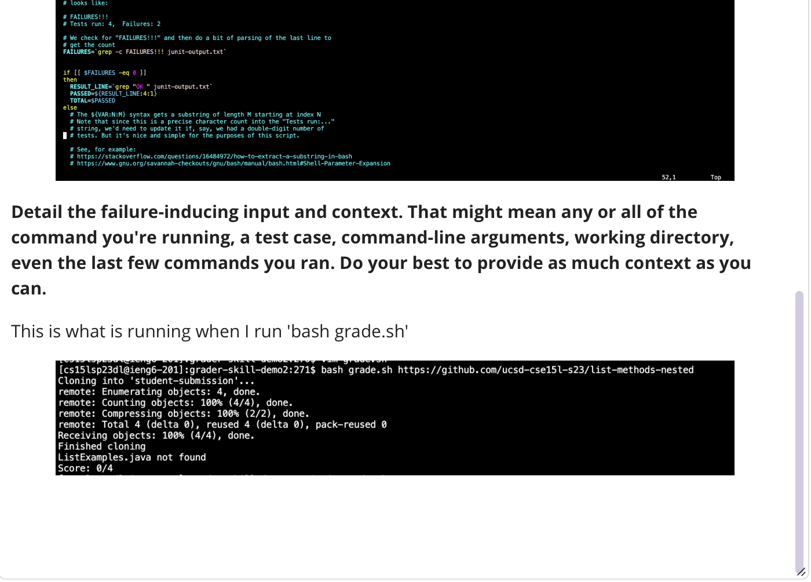
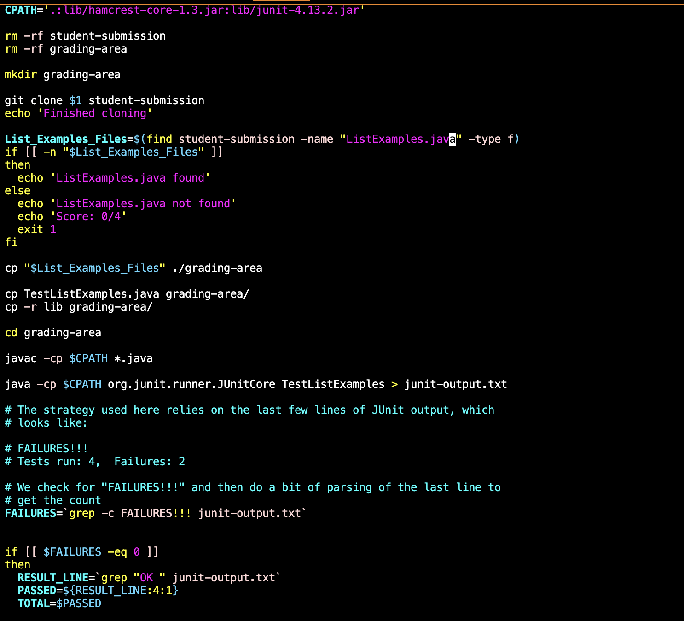
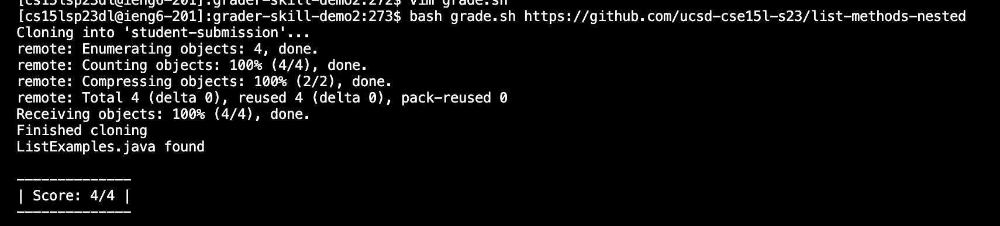
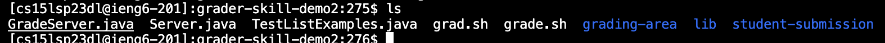
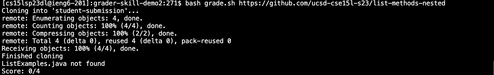

# Lab 5
## Part 1: Debugging Scenerio

**1.TA Response**
- Thank you for the question. So it looks like here that you are trying to find ListExamples.java anywhere in the students-submission directory. The code looks correctly implemented, you have all they key details down. One thing you need to make sure is write what you are exaclty looking for. If your looking for a specific file type then state the file type. Say I am looking for a .sh file. It should show all the .sh files. Here your code isn't doing that. Take a look again, and see if you can use this idea in your code. 

**2.Student Response**
- I see. So the bug in my code is in line 11. I am missing .java on the end of ListExamples. The code is looking for a certain type of file and can't find anything because of that simple error. Thank you. 

**3.All setup**

- To begin working you need to make sure you are in the right directory/repository. This should be the grader-skill-demo2.

- Run using bash to see if grade.sh is working.

- Next you need to open up your contents in grade.sh since that is where your bug is.
- Command line: `vim grade.sh`
- Then fix the bug by adding .java to the end of ListExamples on line 11

- Lastly run the code again to see if that fixed the mistake. 

## Part 2: Reflection

**The biggest thing that I learned over the quarter, and found that was really interesting/useful to use was running things using only the command line. There were so many unique of different cobinations of methods that we would use in the command line. Sometimes it would be stressful trying to learn how to use some, but once it stuck to my brain they were very useful to use. I am defintely going to continue to use these tools that I leanred this quarter in the furture. I also thought vim was really cool to edit files. To me, it was easier to access the files, and edit them. Overall, I thought this class was very useful, because it taught me alot of shortcuts, and tips. Some of which I really enjoy to use.**
